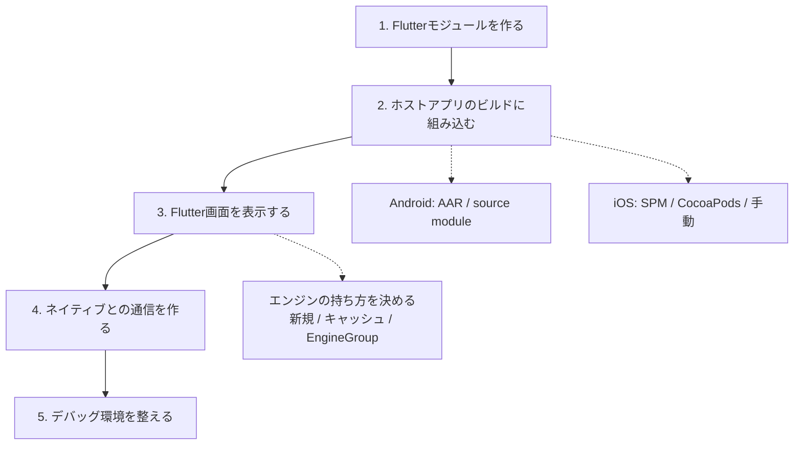

# add-to-app 導入手順ガイド

既存のネイティブアプリにFlutterを組み込む（add-to-app）ための手順を、
[公式ドキュメント](https://docs.flutter.dev/add-to-app)を踏まえてまとめる。

プロジェクト固有の内容は含めず、一般的な手順として書く。本リポジトリで実際に
作業した記録は `WORK_LOG.md` を参照。

---

## 1. add-to-app とは

アプリ全体をFlutterで書き直すのではなく、**Flutterをライブラリとして既存アプリに
組み込み、画面や部品の単位で置き換えていく**方式。Android / iOS / macOS / Web に
対応している。

代表的な使い方は2つ。

- **ハイブリッドなナビゲーションスタック** — ネイティブ画面とFlutter画面を
  行き来する
- **画面の一部分だけFlutter** — ネイティブのUIの中にFlutterの領域を埋め込む

### 先に知っておくべき制約

導入方式を決める前に、公式が明示している制約を把握しておく。**後から気づくと
設計のやり直しになる**ものが含まれる。

| 制約 | 内容 |
|---|---|
| **1アプリに1モジュール** | 複数のFlutterライブラリを1つのアプリに組み込むことはできない |
| モバイルはマルチエンジンのみ | 1つのDartプログラムから複数のビューを出す方式（マルチビュー）はWeb専用 |
| AndroidXが必須 | Androidホストアプリは AndroidX 化されている必要がある |
| プラグインの前提 | プラグインは `FlutterPlugin` インターフェースに対応している必要がある。`FlutterActivity` が常に存在する前提で書かれたプラグインは動かないことがある |
| 対応ABI | Androidは x86_64 / armeabi-v7a / arm64-v8a のみ |

1つ目が特に重要で、**画面ごとにFlutterモジュールを分ける構成は取れない**。
複数画面をFlutter化する場合は、1つのモジュールの中で分割する。

---

## 1.5. 着手前に確認するバージョン

**Flutter SDK のバージョンが、ホストアプリのビルドツールに要求する下限を
決める。** ここを先に確認しないと、組み込んだ直後にビルドが3回連続で失敗する
（実際にそうなった）。

要求される下限はFlutter SDKの更新で上がるため、**手元のSDKで確認するのが
確実**。以下は Flutter 3.47.1 で確認した値。

| 対象 | 要求 | 確認方法 |
|---|---|---|
| Android: Gradle | 8.14 以上 | `gradle/wrapper/gradle-wrapper.properties` |
| Android: Android Gradle Plugin | 8.11.1 以上 | ルートの `build.gradle` |
| Android: Gradleを動かすJDK | 17 以上 | `./gradlew -version` の `Launcher JVM` |
| iOS: Xcode | 15.0 以上 | `xcodebuild -version` |
| iOS: SPM方式を使う場合のFlutter | 3.44 以上 | `flutter build --help` に `swift-package` があるか |

いずれも満たしていない場合は、Flutter Gradleプラグインが具体的な下限を挙げた
エラーを出す。

```
> Error: Your project's Gradle version (8.9.0) is lower than Flutter's
  minimum supported version of 8.14.0. Please upgrade your Gradle version.

> Error: Your project's Android Gradle Plugin version (8.7.0) is lower than
  Flutter's minimum supported version of Android Gradle Plugin version 8.11.1.
```

> **「Java 17 以上」はホストアプリの `compileOptions` の話ではない。**
> 要求されるのは **Gradleを動かすJDK** のバージョン。`compileOptions` を
> `VERSION_1_8` のままにしてもビルドは通る（検証済み）。公式ドキュメントは
> この要求の説明に `compileOptions` のスニペットを併記しているため誤解しやすい。

### モジュールの配置

Flutterモジュールは**ホストアプリと兄弟ディレクトリ**に置く。以降のスニペットは
すべてこの配置を前提にしている。

```
my_flutter_module/
  lib/
MyNativeApp/
  ...
```

---

## 2. 全体の流れ



各ステップでビルドと動作確認を行い、一気に作り切ってから動かそうとしないこと。
ネイティブ側との統合はビルド設定の相性問題が起きやすく、早い段階で切り分けた
方が原因調査がしやすい。

---

## 3. ステップ1: Flutterモジュールを作る

```bash
flutter create -t module --org com.example flutter_module
```

通常のFlutterアプリではなく **モジュール** として作る点が重要。生成される
`.android/` と `.ios/` は、ホストアプリに組み込むための足場と、モジュール単体で
動作確認するためのラッパーアプリを兼ねている。

> **`.android/` と `.ios/` を直接編集しない。** これらは `flutter pub get` の
> たびに再生成され、変更は失われる。バージョン管理からも除外する。

### モジュール名の付け方

1アプリに1モジュールしか組み込めないため、**このモジュールは将来Flutter化する
すべての画面の置き場**になる。最初にFlutter化する機能の名前を付けると、2画面目を
足した時点で実態と合わなくなる。ホストアプリに紐づく名前にしておく。

### androidPackage の確認

`pubspec.yaml` の `module.androidPackage` は、ホストアプリのパッケージ名と
異なる必要がある。同じだとDexのマージで衝突する。

ただし **`flutter create` はモジュール名から自動的に別の値を生成する**ため、
通常は何もしなくてよい（`com.example.<module_name>` になる）。モジュール名を
ホストアプリ名と同じにした場合だけ問題になる。**作業ではなく確認事項。**

---

## 4. ステップ2-A: Androidへ組み込む

### 前提条件

1.5節の表を先に確認すること。Gradle・Android Gradle Plugin・JDK のいずれかが
下限を下回っていると、組み込んだ直後にビルドが失敗する。

### リポジトリ設定を settings.gradle に集約する

各 `build.gradle` の `repositories` ブロックを削除し、`settings.gradle` に
まとめる。**Flutterエンジン本体の配布先を明示的に追加する**のを忘れない。

```groovy
dependencyResolutionManagement {
    repositoriesMode = RepositoriesMode.PREFER_SETTINGS
    repositories {
        google()
        mavenCentral()
        maven { url = uri("https://storage.googleapis.com/download.flutter.io") }
    }
}
```

> **`FAIL_ON_PROJECT_REPOS` にしているプロジェクトは、この設定のまま組み込むと
> ビルドが失敗する。** Flutterのgradleプラグインがプロジェクトレベルで独自に
> リポジトリを追加するため。`PREFER_SETTINGS` に緩和する。
>
> ```
> > Failed to apply plugin 'dev.flutter.flutter-gradle-plugin'.
>    > Build was configured to prefer settings repositories over project
>      repositories but repository 'maven' was added by plugin
>      'dev.flutter.flutter-gradle-plugin'
> ```
>
> 緩和後は同じ文言が**警告として**出るだけになる（正常）。

> ここで削除するのは**依存解決用**の `repositories` であって、ルートの
> `buildscript { repositories { ... } }` は残す。両者は別物で、後者を消すと
> ビルドツール自体が解決できなくなる。

### 組み込み方式を選ぶ

| 方式 | 向いているケース |
|---|---|
| **source module** | ローカル開発・PoC。ワンステップで組み込めるが、ビルドする全員のマシンにFlutter SDKが必要 |
| **AAR** | 大規模チーム・配布。Flutterモジュールのビルドとホストアプリのビルドを分離でき、ホスト側の開発者はFlutter SDK不要 |

判断の軸は「Flutterコードの量」ではなく **Flutterを触らない人の割合**。
Flutterコードが増えるほどAARは（Flutter開発者にとっては）不便になる。Dartを
1行直すたびにビルドとpublishが必要でホットリロードも効かないため。

**source module**

```groovy
// settings.gradle
include(":app")
setBinding(new Binding([gradle: this]))
def filePath = settingsDir.parentFile.toString() + "/flutter_module/.android/include_flutter.groovy"
apply from: filePath
```

```groovy
// app/build.gradle
dependencies {
    implementation(project(":flutter"))
}
```

ここで増えるサブプロジェクト名は **`:flutter` に固定**されている。これが
「1アプリに1モジュール」という制約の実体でもある。

**AAR**

```bash
cd flutter_module
flutter build aar
```

出力されたローカルmavenリポジトリを `settings.gradle` に追加し、build type ごとに
依存を指定する。

```groovy
dependencies {
    debugImplementation   'com.example.flutter_module:flutter_debug:1.0'
    profileImplementation 'com.example.flutter_module:flutter_profile:1.0'
    releaseImplementation 'com.example.flutter_module:flutter_release:1.0'
}
```

> AARが提供するのは `debug` / `profile` / `release` の3つのみ。ホストアプリに
> 独自のbuild type（`staging` など）があると解決に失敗するため
> `matchingFallbacks` が必要になる。また `profile` build type の定義も要る。

### ABIを絞る（任意）

Flutterは x86_64 / armeabi-v7a / arm64-v8a のみ対応。**未設定でもビルド・実行は
できる**（検証済み）。ホストアプリがこれ以外のABIをサポートしている場合に、
Flutterが提供しないABI向けのAPKが壊れるのを避けるために絞る。

```groovy
android {
    defaultConfig {
        ndk { abiFilters "armeabi-v7a", "arm64-v8a", "x86_64" }
    }
}
```

---

## 5. ステップ2-B: iOSへ組み込む

iOSは方式が3つあり、**どれを選ぶかがAndroidより重要**。CocoaPodsのレジストリが
**2026年12月2日に読み取り専用**になるため、新規導入でCocoaPodsを選ぶ理由は
ほぼ無くなっている。

| 方式 | 状態 | 備考 |
|---|---|---|
| **Swift Package Manager** | **推奨**（Flutter 3.44以降） | 現在の公式手順 |
| CocoaPods | メンテナンスモード | 既にCocoaPodsを使っているプロジェクト向け |
| 手動フレームワーク埋め込み | レガシー | CocoaPodsもSPMも使えない場合 |

前提: Xcode 15.0 以上。Flutterアプリとネイティブアプリは兄弟ディレクトリに置く。

### 方式1: Swift Package Manager（Flutter 3.44+）

```bash
flutter build swift-package --platform ios
```

`build/ios/SwiftPackages/` に `FlutterNativeIntegration` パッケージと
連携用スクリプトが出力される。

> **出力先が `build/` 配下、つまりバージョン管理対象外**である点に注意。
> Androidのsource moduleは `.android/` を `flutter pub get` が生成するが、
> iOSのSPM方式は**このコマンドを明示的に実行しないとXcodeプロジェクトが開けない**。
> チェックアウト直後とCIでは、ビルドの前に必ず実行する。

Xcode側の作業は次の通り。

1. 生成されたパッケージを **Add Files to...** で追加（**Reference files in place**）
2. Target の **General** → **Frameworks, Libraries, and Embedded Content** に追加
3. Build Settings に `FLUTTER_SWIFT_PACKAGE_OUTPUT` を設定
4. Scheme の **Pre-action** に `flutter_integration.sh prebuild` を追加
5. Build Phases に Run Script `flutter_integration.sh assemble` を追加
   （**「Based on dependency analysis」のチェックを外す**）

Xcodeからビルドするたびにflutterアプリを再ビルドさせたい場合は
`FLUTTER_APPLICATION_PATH` と `ENABLE_USER_SCRIPT_SANDBOXING=NO` も設定する。

#### プロジェクト生成ツールを使っている場合

XcodeGenやTuistでプロジェクトを生成している場合、**上記のGUI操作は再生成の
たびに失われる**ため、定義ファイル側に書く必要がある。XcodeGen での対応は
次の通りで、6手順すべて表現できる（検証済み）。

| 手順 | XcodeGen での書き方 |
|---|---|
| 1. パッケージを追加 | `packages:` に `path:` でローカルパッケージを定義 |
| 2. Frameworks に追加 | target の `dependencies: - package: FlutterNativeIntegration` |
| 3. Build Settings | `settings.base` に `FLUTTER_SWIFT_PACKAGE_OUTPUT` |
| 4. Scheme の Pre-action | `schemes.<name>.build.preActions`（`settingsTarget` の指定が要る） |
| 5. Run Script + 入力リスト | `postCompileScripts` に `basedOnDependencyAnalysis: false` と `inputFileLists` |

```yaml
packages:
  FlutterNativeIntegration:
    path: ../my_flutter_module/build/ios/SwiftPackages/FlutterNativeIntegration

targets:
  MyApp:
    dependencies:
      - package: FlutterNativeIntegration
    settings:
      base:
        FLUTTER_SWIFT_PACKAGE_OUTPUT: $(SRCROOT)/../my_flutter_module/build/ios/SwiftPackages
        FLUTTER_APPLICATION_PATH: $(SRCROOT)/../my_flutter_module
        ENABLE_USER_SCRIPT_SANDBOXING: NO
    postCompileScripts:
      - name: "[Flutter] assemble"
        script: /bin/sh "$FLUTTER_SWIFT_PACKAGE_OUTPUT/Scripts/flutter_integration.sh" assemble
        basedOnDependencyAnalysis: false
        inputFileLists:
          - $(FLUTTER_SWIFT_PACKAGE_OUTPUT)/Scripts/FlutterAssembleInputs.xcfilelist

schemes:
  MyApp:
    build:
      preActions:
        - name: "[Flutter] prebuild"
          script: /bin/sh "$FLUTTER_SWIFT_PACKAGE_OUTPUT/Scripts/flutter_integration.sh" prebuild
          settingsTarget: MyApp
```

#### SPM方式で import するモジュール

`FlutterNativeIntegration` は**中身が空のシム**で、Flutter本体は別モジュールに
ある。Swiftからは次の2つをimportする。

```swift
import Flutter                    // FlutterEngine, FlutterViewController など
import FlutterPluginRegistrant    // GeneratedPluginRegistrant
```

パッケージの依存関係は
`FlutterNativeIntegration → FlutterPluginRegistrant → FlutterFramework → Flutter`
となっており、`import FlutterNativeIntegration` だけでは
`cannot find 'FlutterEngineGroup' in scope` になる。

### 方式2: CocoaPods

```ruby
flutter_application_path = '../flutter_module'
load File.join(flutter_application_path, '.ios', 'Flutter', 'podhelper.rb')

target 'MyApp' do
  install_all_flutter_pods(flutter_application_path)
  flutter_post_install(installer) if defined?(flutter_post_install)
end
```

```bash
pod install
```

> `flutter_post_install` を書かないと
> `Missing flutter_post_install(installer) in Podfile post_install block`
> で失敗する。このフックがbitcode設定・デプロイメントターゲット・Swiftバージョン
> などを自動調整している。

ここで作られるPod名は **`Flutter` / `FlutterPluginRegistrant` に固定**されて
おり、これがiOS側における「1アプリに1モジュール」制約の実体になる。

以降、ビルドは必ず **`.xcworkspace`** に対して行う。`.xcodeproj` を直接開くと
Flutter依存が解決されない。

> **XcodeGen / Tuist などでプロジェクトを生成している場合は順序に注意。**
> プロジェクト再生成はCocoaPodsが `.pbxproj` に注入したビルドフェーズを消すため、
> 「プロジェクト生成 → `pod install` → ビルド」の順を毎回守る。

### 方式3: 手動フレームワーク埋め込み

```bash
flutter build ios-framework --output=release
```

出力された `App.xcframework` / `Flutter.xcframework` /
`FlutterPluginRegistrant.xcframework` と各プラグインの `.xcframework` を、
**Frameworks, Libraries, and Embedded Content** に追加する（Copy Bundle
Resources ではない）。加えて Run Script Build Phase に
`xcode_backend.sh build` と `xcode_backend.sh embed` を追加する。

この方式ではDartを直しても、再度コマンドを実行するまでホスト側に反映されない
（AndroidのAARと同じ性質）。

### Debugビルドにローカルネットワーク権限を追加する

**`flutter attach` によるホットリロード／DevToolsにはローカルネットワーク権限が
必要**で、これが無いとデバッグ時に接続できない。Debug構成のInfo.plistにのみ
次を追加する。

```xml
<key>NSBonjourServices</key>
<array>
  <string>_dartVmService._tcp</string>
</array>
<key>NSLocalNetworkUsageDescription</key>
<string>Allows Flutter debugging and hot reload</string>
```

Release構成には `_dartVmService._tcp` を含めない。Build Settings の
**Info.plist File** を `$(SRCROOT)/path/to/Info-$(CONFIGURATION).plist` に
することで構成ごとに切り替えられる。

---

## 6. ステップ3: Flutter画面を表示する

### エンジンの持ち方を決める

ここが設計上もっとも影響の大きい選択になる。

| 方式 | 起動速度 | メモリ | 向いている用途 |
|---|---|---|---|
| **新規エンジン** | 遅い | 1つあたり数十MB | 画面が1〜2個で、毎回状態を初期化したい |
| **キャッシュエンジン** | 速い | 常時1つ分を保持 | タブなど長く生き続ける画面 |
| **FlutterEngineGroup** | 2つ目以降が速い | **追加分は約180kB** | 画面数が増えていく前提 |

**`FlutterEngineGroup` を既定にしてよい。** グループから生成したエンジンは
GPUコンテキスト・フォントメトリクス・isolate group snapshot を共有するため、
2つ目以降の増分がごくわずかで済む。1つ目の生成コストは従来と同じ。

グループ内で **共有されるもの／されないもの** は次の通り。

| 共有される | 独立している |
|---|---|
| GPUコンテキスト | ナビゲーションスタック |
| フォントメトリクス | UIの描画 |
| isolate group snapshot | アプリの状態 |

エンジン同士は独立したDartプログラムなので、**Dartコード同士は直接やり取り
できない**。必要ならプラットフォームチャネルを経由する。

> 少なくとも1つのエンジンが生存している必要がある。すべて破棄すると、次に
> 作るエンジンは「1つ目」のコストに戻る。

### Android

`AndroidManifest.xml` にFlutter画面用のActivityを登録する。

```xml
<activity
  android:name="io.flutter.embedding.android.FlutterActivity"
  android:theme="@style/AppTheme"
  android:configChanges="orientation|keyboardHidden|keyboard|screenSize|locale|layoutDirection|fontScale|screenLayout|density|uiMode"
  android:hardwareAccelerated="true"
  android:windowSoftInputMode="adjustResize" />
```

> **公式ドキュメントのスニペットは `@style/LaunchTheme` を参照しているが、
> これはFlutterが新規アプリを生成するときに作るテーマであり、既存のネイティブ
> アプリには存在しない。** そのまま貼るとビルドが失敗する。
>
> ```
> AAPT: error: resource style/LaunchTheme
>   (aka com.example.myapp:style/LaunchTheme) not found.
> ```
>
> ホストアプリ既存のテーマを指定するか、専用のテーマを定義する。
>
> なお「Flutter側の `Scaffold` とホストのActionBarが二重に表示される」という
> 問題は、**`FlutterActivity` では発生しなかった**（AppCompat系・framework系の
> ActionBarテーマの両方で確認）。`FlutterActivity` は `AppCompatActivity` では
> ないため。`FlutterFragment` をActionBarを描くActivityに埋め込む場合は
> 起こり得る。

起動方法は方式によって変わる。

```kotlin
// 新規エンジン
startActivity(FlutterActivity.withNewEngine().initialRoute("/my_route").build(this))

// キャッシュエンジン
startActivity(FlutterActivity.withCachedEngine("my_engine_id").build(this))
```

**推奨する `FlutterEngineGroup` を使う場合**は、グループからエンジンを生成し、
それを `FlutterEngineCache` に入れて `withCachedEngine` で起動する、という
2つの仕組みの組み合わせになる。

```kotlin
val group = FlutterEngineGroup(context)
val engine = group.createAndRunEngine(
    context,
    DartExecutor.DartEntrypoint.createDefault(),
    "/my_route",          // 初期ルート
)
FlutterEngineCache.getInstance().put(ENGINE_ID, engine)
startActivity(FlutterActivity.withCachedEngine(ENGINE_ID).build(context))
```

`FlutterActivity.NewEngineInGroupIntentBuilder` を使えばキャッシュを介さずに
起動することもできる。

**キャッシュエンジンで初期ルートを指定する場合は、Dartのエントリポイントを
実行する前に設定する。** 実行後では手遅れになる。

```kotlin
flutterEngine.navigationChannel.setInitialRoute("your/route/here")
flutterEngine.dartExecutor.executeDartEntrypoint(DartExecutor.DartEntrypoint.createDefault())
```

画面の一部分にFlutterを埋め込む場合は `FlutterFragment` を使う。

### iOS

`FlutterViewController` を表示する。エンジンをどう用意するかはAndroidと同じ
選択になる。`FlutterEngineGroup` を使う場合は次の形になる。

```swift
import Flutter
import FlutterPluginRegistrant

private static let engineGroup = FlutterEngineGroup(name: "my_group", project: nil)

static func viewController(route: String) -> UIViewController {
    // entrypoint に nil を渡すと main() が使われる
    let engine = engineGroup.makeEngine(
        withEntrypoint: nil,
        libraryURI: nil,
        initialRoute: route
    )
    GeneratedPluginRegistrant.register(with: engine)
    return FlutterViewController(engine: engine, nibName: nil, bundle: nil)
}
```

> オプション型は `FlutterEngineGroup` のネストした型ではなく
> `FlutterEngineGroupOptions` という独立したクラス。Swiftから
> `FlutterEngineGroup.Options` と書くと
> `type 'FlutterEngineGroup' has no member 'Options'` になる。

> **プラグインの登録はエンジンを実行した後に行う。** 順序を誤ると
> `Setting a message handler before the FlutterEngine has been run` で
> クラッシュする。

> **ナビゲーションバーの二重表示。** Androidのテーマと同じ問題で、ホストの
> `UINavigationController` のバーとFlutter側のAppBarが重なる。表示・非表示を
> 切り替える。

### 初期ルートを渡すときの落とし穴

`MaterialApp` の `initialRoute` は **`/` で分割されて複数の画面が積まれる**。
`/confirm` を渡すと `['/', '/confirm']` の2画面になり、最初のFlutter画面で
戻る操作をしたときにネイティブに戻らず `/` の画面が現れる。

押す前に気づける手がかりがある。**画面スタックが2つあるため、Flutter側の
AppBarに意図しない戻る矢印が表示される。**

add-to-appでは「Flutterの画面スタックの底で戻ったらネイティブ側のコンテナに
抜ける」のが正しい。`onGenerateInitialRoutes` を渡して初期スタックを1画面に
固定する。

```dart
List<Route<Object?>> onGenerateInitialRoutes(String initialRoute) {
  return <Route<Object?>>[onGenerateRoute(RouteSettings(name: initialRoute))];
}
```

### キャッシュエンジンのライフサイクル

キャッシュエンジンは `FlutterActivity` / `FlutterViewController` より長生きし、
**画面が破棄された後もDartコードは動き続ける**。これは意図的な仕様で、UIが
無い状態での通信やデータ処理に使える一方、止めたい場合は明示的に
`destroy()` する必要がある。

---

## 7. ステップ4: ネイティブとの通信

Flutterとネイティブのやり取りは**プラットフォームチャネル**で行う。

### チャネルは画面単位ではなく機能単位で切る

画面ごとにチャネルを用意すると、画面数だけハンドラが増えていく。機能単位に
すれば画面が増えてもチャネルは増えず、**機能がFlutterへ移るたびに減っていく**。
最終的に全面Flutter化するなら、これが正しい方向になる。

| 例 | 役割 |
|---|---|
| `<app>/navigation` | Flutterの領域から出る遷移をネイティブへ依頼する |
| `<app>/legacy_store` | 移行前のネイティブコードが保存したローカルデータを読む |
| `<app>/session` | 認証トークン・共通ヘッダ |

### 既存のローカルデータの引き継ぎ

Flutterのプラグインは既定ではネイティブが保存した既存データを見ない。

| 種類 | 既存データをそのまま読めるか |
|---|---|
| SQLite | **読める**（絶対パスでファイルを開くだけ） |
| キーバリューストア | **既定では読めない**（キーにプレフィックスが付く。Androidは保存先ファイルもFlutter専用になる） |
| ファイル | Androidは要注意（「ドキュメント」の解決先がネイティブと異なる） |
| セキュアストレージ | 命名規則を合わせる必要がある |

技術的に読めるかどうかとは別に、**そのデータの所有者をネイティブとFlutterの
どちらにするかを先に決める**こと。移行期間中に両側から同じデータを読み書き
できる状態にすると、どちらが最新か分からない不整合が残り続ける。

---

## 8. ステップ5: デバッグ

アプリを起動するのはネイティブのIDE側なので、`flutter run` は使えない。
アプリを起動してFlutter画面を表示した状態で **`flutter attach`** する。
ホットリロード・ホットリスタート・DevToolsがそのまま使える。

```bash
cd flutter_module
flutter attach -d <device-id>
```

対話操作なしでホットリロードしたい場合は `--pid-file` を使う。

```bash
flutter attach -d <device-id> --pid-file=/tmp/flutter.pid
kill -SIGUSR1 $(cat /tmp/flutter.pid)   # ホットリロード
kill -SIGUSR2 $(cat /tmp/flutter.pid)   # ホットリスタート
```

> **iOSで `flutter attach` が `Waiting for a connection` から進まない場合。**
> ローカルネットワーク権限を入れても自動探索が成功しないことがある
> （Xcode 26.6 / iOSシミュレータ / Flutter 3.47.1 で確認）。
> VMサービス自体は起動しているので、デバイスログからURLを拾って直接渡す。
>
> ```bash
> xcrun simctl spawn <udid> log show --last 3m \
>   --predicate 'processImagePath CONTAINS "MyApp"' --style compact \
>   | grep "Dart VM service"
> # flutter: The Dart VM service is listening on http://127.0.0.1:65135/AHGlBZAIIvs=/
>
> flutter attach -d <udid> --debug-url "http://127.0.0.1:65135/AHGlBZAIIvs=/"
> ```

> **ホットリロードが「成功」と出るのに画面が変わらない場合。**
> ルートの画面をインラインのクロージャで組んでいると反映されない。
>
> ```dart
> // 反映されない
> builder: (_) => Scaffold(appBar: AppBar(...), body: ...)
> // 反映される
> builder: (_) => MyScreen()
> ```
>
> 画面はWidgetクラスとして切り出す。切り出せない場合はホットリスタートで
> 確認する。

デバッグ対象によって使う道具が変わる。

| 対象 | 使うもの |
|---|---|
| Dartのコード | `flutter attach` + DevTools |
| ネイティブのコード | Android Studio / Xcode のデバッガ |
| 境界（チャネル） | 両側にログ。チャネル名・メソッド名・引数の型のいずれかが食い違うと**無言で失敗する** |

---

## 9. 段階移行を安全に進めるために

### フィーチャーフラグを1画面目の時点で入れる

Flutter化した画面に問題が見つかったとき、**リリースを待たずにネイティブ実装へ
戻せる退路**を用意しておく。画面が増えてから後付けするのは難しい。

判断は1箇所に集約する。呼び出し側がフラグを直接見る作りにすると、Flutter化
するたびに分岐がアプリ中に散らばる。「この画面へ行きたい」という要求を受けて
ネイティブ実装とFlutter実装のどちらを開くかを決める層を1つ作る。

これはデバッグにも効く。同じ画面のネイティブ実装とFlutter実装を実行時に
切り替えられるため、「Flutter化して出た問題」か「元からあった問題」かを
その場で切り分けられる。

### 新規コードの言語

Flutter統合のために新規に書くコードは、既存がJava / Objective-Cであっても
Kotlin / Swiftで書いてよい。

- **Android** — 同一Gradleモジュール内でJavaとKotlinは共存でき、相互に
  呼び出せる。JavaとKotlinで **JVMターゲットが揃っていないと**
  `Inconsistent JVM-target compatibility detected` で失敗する
- **iOS** — Objective-CからSwiftを参照するには自動生成される
  `<ProductModuleName>-Swift.h` をimportする。SwiftからObjective-Cを参照する
  にはBridging Headerを設定する。Swiftファイルを1つでも追加する場合は
  `SWIFT_VERSION` と `ALWAYS_EMBED_SWIFT_STANDARD_LIBRARIES` を設定する
  - **Bridging Header は「Swift→ObjC」だけの話ではない。** Bridging Header が
    無いと、生成される `-Swift.h` に **`internal` な `@objc` クラスが
    書き出されない**（`public` にすれば出る）。結果として
    Objective-C 側が `use of undeclared identifier` になる。検証結果:

    | 条件 | `internal` な `@objc` クラスが `-Swift.h` に出るか |
    |---|---|
    | Bridging Header なし | 出ない |
    | Bridging Header あり | 出る |
  - XcodeGenなどで生成している場合、`SWIFT_INSTALL_OBJC_HEADER` と
    `SWIFT_OBJC_INTERFACE_HEADER_NAME` が既定で設定されないことがある

### 落とし穴チェックリスト

| 症状 | 原因 |
|---|---|
| 組み込んだ瞬間にAndroidビルドが失敗 | `repositoriesMode` が `FAIL_ON_PROJECT_REPOS` |
| `Inconsistent JVM-target compatibility detected` | JavaとKotlinのターゲット不一致 |
| `pod install` が `Missing flutter_post_install` で失敗 | Podfileの `post_install` フック未記載 |
| iOSでビルドは通るがFlutter依存が見つからない | `.xcodeproj` を直接開いている |
| プロジェクト再生成後にFlutterのビルドフェーズが消える | 生成 → `pod install` の順序を守っていない |
| `Setting a message handler before the FlutterEngine has been run` | プラグイン登録がエンジン実行より前 |
| AppBar／ナビゲーションバーが二重に出る | ホスト側のバーを非表示にしていない |
| 戻る操作でネイティブに戻らない | `initialRoute` が分割されて複数画面積まれている |
| 画面を増やすほどメモリが増える | エンジンを `FlutterEngineGroup` から生成していない |
| Flutter画面を閉じても処理が動き続ける | キャッシュエンジンを `destroy()` していない |
| iOSで `flutter attach` が繋がらない | ローカルネットワーク権限が無い／自動探索が働かない（`--debug-url` を使う） |
| Androidビルドが Gradle / AGP のバージョンで失敗 | Flutter SDKが要求する下限を下回っている（1.5節） |
| `AAPT: error: resource style/LaunchTheme not found` | 公式スニペットのテーマは既存アプリに存在しない |
| Objective-Cから `use of undeclared identifier <Swiftのクラス>` | Bridging Header が無く `-Swift.h` に書き出されていない |
| `cannot find 'FlutterEngineGroup' in scope`（SPM） | `import Flutter` していない |
| ホットリロードが「成功」なのに画面が変わらない | ルートの画面がインラインのクロージャ |

---

## 参考

- [Add Flutter to an existing app](https://docs.flutter.dev/add-to-app)
- [Integrate a Flutter module into your Android project](https://docs.flutter.dev/add-to-app/android/project-setup)
- [Adding a Flutter screen to an Android app](https://docs.flutter.dev/add-to-app/android/add-flutter-screen)
- [Integrate a Flutter module into your iOS project](https://docs.flutter.dev/add-to-app/ios/project-setup)
- [Multiple Flutter instances](https://docs.flutter.dev/add-to-app/multiple-flutters)
- [Debugging your add-to-app module](https://docs.flutter.dev/add-to-app/debugging)
